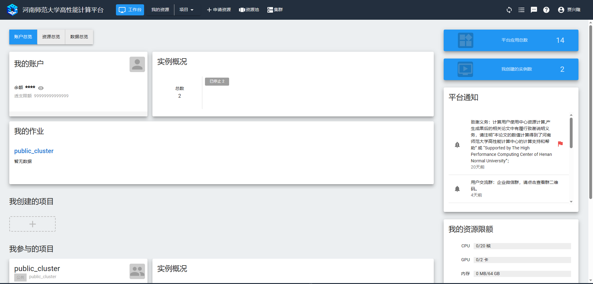

# 环境准备

## 下载必备的组件

首先到私有云下载必备的组件包，私有云地址如下：

<http://10.10.75.200:5000>

登录自己的私有云账号，如果没有账号请联系贺杨乐师兄

需要的组件在以下路径内，把其中的内容下载到本地

```text
/Library/HepProgrames/CheckMATE/CheckMATE脚本安装包/
```

<span style="color: red;">注意：必须下载到 Linux 系统或者 Mac 系统的本地</span>

文件夹 <span style="color: blue;">“CheckMATE脚本安装包”</span> 内，应包括以下内容

```text
checkmate2-master.zip
delphes-master.zip
HelloHEP.sh
hepmc2.06.11.tgz
pythia8245.tgz
root_v6.18.04.source.tar.gz
```

其中 <span style="color: green;">HelloHEP.sh</span> 不是必要的，剩下的五个压缩包中 `root_v6.18.04.source.tar.gz` 是必要的，如果进一步要安装 `checkmate` 则其余几个压缩包也是必要的。

<span style="color: green;">HelloHEP.sh</span> 是一个在 **`Ubuntu`** 系统下安装 `cern root` 和 `checkmate` 等软件包的脚本

## 重置高性能计算中心的用户密码

进入链接 <https://hpc.htu.edu.cn/> ，点击 **通过统一认证服务登录** 以进入河南师范大学高性能计算平台的用户界面，首次登录使用的是自己的学号以及河南师范大学办事大厅的密码




点击右上角的用户姓名，打开下来菜单点击 **重置密码**


输入新密码并再次输入以确认


点击确认以完成密码的修改

## 公共集群上的准备

现在打开一个本地终端，输入以下命令，登录到公共集群，之所以这样查看，是因为如下内容，服务器外部地址中 `:` 后的内容是端口


   
```bash
ssh -p 20015 用户名@59.70.85.6
```

`用户名` 的位置填写你在公共集群上的用户名，下同

比如我的用户名是 **u2002084003** 所以命令就是 

```bash
ssh -p 20015 u2002084003@59.70.85.6
```

**-p 20015** 参数指的是目标地址的端口

密码是刚刚重置密码时输入的密码

登录上之后，使用 `mkdir` 命令在用户目录下新建三个文件夹。

```bash
mkdir Downloads Dependencies opt
```
其中：\
第一个 <span style="color: blue;">Downloads</span> 文件夹用于存放所需的有安装包。\
第二个 <span style="color: blue;">Dependencies</span> 文件夹用于存放所有的赖项。\
第三个 <span style="color: blue;">opt</span> 文件夹用于存放所有安装的软件包。\
后面的说明都会采用这些名称，但是也可以按照自己的习惯对文件夹自行命名

现在进入 <span style="color: blue;">Downloads</span> 文件夹，输入以下命令，下载所需的依赖库的 **<span style="color: red;">rpm</span>** 格式安装包

```bash
yumdownloader libXpm-devel
```

这行命令会下载两个 **<span style="color: red;">rpm</span>** 格式安装包

```text
libXpm-devel-3.5.12-2.el7_9.i686.rpm
libXpm-devel-3.5.12-2.el7_9.x86_64.rpm
```

其中 **<span style="color: red;">3.5.12-2.el7</span>** 表示版本号，根据下载时间的不同版本号可能会有不同

我们需要的是尾缀 **<span style="color: red;">x86_64</span>** 的安装包，因为公共集群的服务器是 64 位系统

## 配置 Anaconda 环境

**Anaconda** 是一个用于科学计算和数据科学的 `Python` 和 `R` 发行版，它包含了许多科学计算和数据科学常用的包，并提供了一个虚拟环境管理工具 `conda` 来管理不同的 `Python` 环境。我们需要使用 **Anaconda** 来管理我们的 `Python` 环境。

可以通过 `wget`  命令下载 **Anaconda** 或它的最小化版本 **miniconda**

但公共集群服务器的系统目录下已经有安装好了的 **Anaconda**\
所以可以使用以下命令直接进行配置

```bash
alias conda=/opt/app/anaconda3/condabin/conda
```

`alias` 是一个用于创建命令别名的命令，执行这行命令就相当于把当前用户当前终端下的 `conda` 命令指向了系统目录内的 `conda`

现在就已经可以使用 **Anaconda** 了，但我们现在使用的是系统内的 **Anaconda**，无法使用 `conda` 的完整功能，并且每次重新启动终端或重新登录公共集群时 `conda` 都不会自动加载。\
这也意味着我们没有自己的 `Python` 环境，也就不能进行任何第三方库的安装。

所以现在我们要初始化 `conda` 的环境配置并新建一个我们自己的 `Python` 环境。

### 初始化 `conda` 的环境配置
首先，使用 `conda init` 命令可以初始化 `conda` 环境，由于公共集群的服务器使用的是 **Bash shell**，所以使用以下命令进行初始化操作

```bash
conda init bash
```

接下来可以查看 `.bashrc` 以检查 `conda` 是否已经添加进了环境变量

```bash
vim ~/.bashrc
```

在 **Bash shell** 中，用户目录即 `~` 目录下的 `.bashrc` 文件被称为用户的环境变量。可以把它理解为一个 **Shell** 脚本，每当用户打开一个新的终端时，终端都会自动执行 `.bashrc` 文件内的命令。

此时 `.bashrc` 文件内应该已经有了如下内容

```bash
# >>> conda initialize >>>
一些 shell 语句 ...
# <<< conda inititalize <<<
```

这表明 `conda` 已经被正确配置了，此时我们重新启动一下环境变量

```bash
source ~/.bashrc
```

这个时候，在终端内命令行的用户名前，就会出现 `(base)` 字样，例如

```text
(base) [用户名@workstation ~]
```

这表明我们已经处于 **Anaconda** 的虚拟 `Python` 环境 `base` 环境中了。

### 创建 `Python` 虚拟环境

接下来配置属于我们自己的 `Python` 虚拟环境

使用 `conda env list` 可以查看当前拥有哪些 `Python` 环境\
如果你没有新建过任何 `Python` 环境，那么这条命令预期会有以下输出

```text
# conda environments:
#
base                    /opt/app/anaconda3
cuda-11.3               /opt/app/anaconda3/envs/cuda-11.3
```

使用 `conda create` 命令配置一个新的环境，可以命名为 `py27` 以保持和 `multinest` 环境相同，也可以按照需求命名为诸如 `smodels` `mg5_2` `mg5_3` `checkmate` 等名称

下面以 `py27` 为例进行配置

```bash
conda create -n py27 python=2.7
```

`create` 表示使用 `conda` 创建一个新 `Python` 环境\
`-n` 表示接下来将指定新环境名称\
`py27` 表示新环境的名称\
`python=2.7` 表示该 `Python` 环境所搭载的 `Python` 版本，这里指定的是 `Python 2.7` 版本

环境创建途中会询问是否继续，输入 `y` 以继续

等待必要的库都自动下载安装完毕后，该环境就已经创建完成了，此时查看环境会有以下预期输出

```bash
conda env list
```

```text
# conda environments:
#
py27                  * /home/用户名/.conda/envs/py27
base                    /opt/app/anaconda3
cuda-11.3               /opt/app/anaconda3/envs/cuda-11.3
```

使用 `conda activate` 命令可以切换环境，例如可以输入以下命令切换到刚才创建的 `py27` 环境

```bash
conda activate py27
```

现在用户名前的 `(base)` 就会变成 `(py27)`，

```text
(py27) [用户名@workstation ~]
```

此时输入 `python` 命令打开 `Python` 交互界面，可以看到 `Python` 的版本确实是 `Python 2.7`

```text
Python 2.7.18 |Anaconda, Inc.| (default, Nov 25 2022, 06:27:37)
[GCC 11.2.0] on linux2
Type "help", "copyright", "credits" or "license" for more information.
>>>
```

根据具体情况的不同，上述输出信息可能与实际情况存在部分差异

至此 **Anaconda** 的 `Python` 虚拟环境的配置已经完成

### 安装 `Python` 第三方库（可选）

使用 `conda create` 命令创建的虚拟环境默认情况下没有任何额外的 `Python` 库，如有需要则必须自行安装

可以使用 `conda install` 或 `pip install` 命令安装需要的 `Python` 库

例如，安装 `cern root` 需要 `Python` 中的 `numpy` 库，使用以下命令可以进行安装

```bash
conda install numpy
或
pip install numpy
```

安装的途中可能会被询问是否确定安装，输入 `y` 以继续安装

## 从本地上传所需的安装包

之前我们已经从私有云上下载了 <span style="color: blue;">“CheckMATE脚本安装包”</span> 文件夹

现在，在本地的 <span style="color: blue;">“CheckMATE脚本安装包”</span> 文件夹内，打开一个新的本地终端，输入以下命令并输入密码把文件夹内的内容全部上传到公共集群的用户文件夹内
   
```bash
scp -p 20015 ./* 用户名@59.70.85.6:/home/用户名/Downloads/
```

<span style="color: red;">**./\***</span> 指的是当前目录下的所有文件， <span style="color: red;">*</span> 被称为 <span style="color: red;">“通配符”</span>

# 安装 `cern root`

首先，需要把 `Python` 环境切换到允许安装 `cern root` 的环境中并在安装过程中全程保持在此环境内。此前示例的 `py27` 环境就是一个可行的环境，以此环境为例进行说明

```bash
conda activate py27
```

## 安装依赖项

`cern root` 所需要的大部分依赖项在公共集群服务器的系统上都已经安装好了，只有 `Python` 的 `numpy` 库以及 `libXpm` 库的 `xpm.h` 文件没有安装

完整的依赖项可以在下面的链接中查看

<https://root.cern/install/dependencies/>

### 安装 `numpy` 库

可以使用以下命令直接在当前所处的 `Python` 环境中安装 `numpy` 库

```bash
conda install numpy
或
pip install numpy
```

### 安装 `xpm.h`

此前，我们已经在 <span style="color: blue;">Downloads</span> 文件夹内下载好了 `libXpm-devel-3.5.12-2.el7_9.x86_64.rpm` 文件

使用 `cp` 命令，把该文件复制到 <span style="color: blue;">Dependencies</span> 文件夹中

```bash
cp libXpm-devel-3.5.12-2.el7_9.x86_64.rpm ~/Dependencies/
```

接下来切换到 <span style="color: blue;">Dependencies</span> 文件夹中

```bash
cd ~/Dependencies
```

接下来使用以下命令在当前目录安装该开发库

```bash
rpm2cpio libXpm-devel-3.5.12-2.el7_9.x86_64.rpm | cpio -idvm
```

`rpm2cpio` **(即 rpm to cpio)** 可以将 `rpm` 文件解压成 `cpio` 形式\
`cpio` 命令，则是用于在 Linux 系统中打包和解包文件\
`-idvm` 中的 `-i` 表示解压（即提取文件），`-d` 表示自动创建目录，`-v` 表示详细输出，`-m` 表示保留文件的时间戳和权限信息\
`|` 被称为 **“管道命令”(pipe)**，它的功能是把左侧命令的输出作为右侧命令的输入并执行

因此这一语句的含义是 `rpm2cpio` 命令将 `libXpm-devel-3.5.12-2.el7_9.x86_64.rpm` 文件解压成 `cpio` 形式的文件输出，然后通过管道将 `cpio` 形式的文件传递给 `cpio -idvm` 命令。

此时使用 `ls` 命令查看当前文件夹下的内容，应该是下面这样的

```bash
(py27) [用户名@workstation Dependencies]$ ls
libXpm-devel-3.5.12-2.el7_9.x86_64.rpm  usr
```

进一步使用 `ls` 命令查看

```bash
(py27) [用户名@workstation Dependencies]$ ls usr/include/X11/
xpm.h
```

这就是我们安装 `cern root` 需要的文件

## 开始安装 `cern root`

再次强调，安装全过程中一定要确保所处的终端位于可行的 `Python` 环境中，并且该环境已安装 `numpy` 库

接着切换到 <span style="color: blue;">Downloads</span> 文件夹中，此处应该有从私有云上下载到本地并从本地上传到的此处的 `root_v6.18.04.source.tar.gz` 压缩包

### 解压缩

使用 `tar` 命令进行解压

```bash
tar -zxvf ./root_v6.18.04.source.tar.gz
```

`-z` 参数表示用gzip来压缩/解压缩文件\
`-x` 参数表示解压\
`-v` 参数表示打印压缩/解压缩的部分细节\
`-f` 参数表示将在后方指定目标文件名

因此也可以选择使用 `tar -zxf` 命令进行解压，这样就不会把解压细节打印到屏幕上

### 移动文件夹

使用 `mv` 命令把解压出来的文件夹移动到想要存放的文件夹处，这里以 `opt` 文件夹为例

```bash
mv -T root-6.18.04 ~/opt/root-6.18.04
```

`-T` 参数表示将源路径视为普通文件，并将其移动到目标路径，而不是将源路径当作目录，并将其目录内容移动到目标路径

### 切换到 `root` 文件夹内

使用 `cd` 命令切换到 `root-6.18.04` 文件夹内 

```bash
cd ~/opt/root-6.18.04
```

此目录内存放了 `cern root` 的所有源代码

### 建立构建目录和安装目录

使用 `mkdir` 命令建立两个文件夹

```bash
mkdir builddir installdir
```

`builddir` 目录为构建目录，在此目录内执行编译和安装操作，编译和安装过程中生成的中间产物会存放在此目录中\
`installdir` 目录为安装目录，软件最终会被安装到此处

建立完这两个目录后，切换到构建目录中

```bash
cd builddir
```

### 生成和配置构建系统

在 `builddir` 目录内，执行以下操作，生成构建系统

```bash
cmake3 -DCMAKE_INSTALL_PREFIX=../installdir ..
```

这行命令表示，将使用 `cmake3` 进行整个软件的编译和安装

第一个参数 `-DCMAKE_INSTALL_PREFIX=../installdir` 表明软件将安装到 `../installdir` 下\
第二个参数 `..` 表明软件源代码在 `..` 目录，即当前目录的上一层目录内

此时，将会遇到一个报错信息

```text
CMake Error at cmake/modules/SearchInstalledSoftware.cmake:262 (message):
  libXpm and Xpm headers must be installed.
Call Stack (most recent call first):
  CMakeLists.txt:159 (include)
```

该报错信息提示我们，找不到 libXpm 和 Xpm 的头文件，因此我们需要到编译缓存文件中手动指定这两个文件的所在之处

使用 `vim` 编辑器打开 `cmake` 缓存文件 `CMakeCache.txt`

```bash
vim CMakeCache.txt
```

在编辑器界面内，依次输入 `/ + Xpm` 并按下键盘上的 `Enter` 键，查找文本中所有出现 `Xpm` 的位置，使用键盘上的 `n` 键在 `Xpm` 出现的不同位置之间进行跳转，最终要找到下面这几行内容

```text
//Path to a file.
X11_Xpm_INCLUDE_PATH:PATH=X11_Xpm_INCLUDE_PATH-NOTFOUND

//Path to a library.
X11_Xpm_LIB:FILEPATH=X11_Xpm_LIB-NOTFOUND
```

可以看到，这两个路径均为 `NOTFOUND` 状态

按下键盘上的 `i` 或 `insert` 键，进入插入模式，即可更改文件内容，操作方式和其它常见编辑器相同。此时界面左下角会提示 `-- INSERT --`

将多余的内容删除

```text
//Path to a file.
X11_Xpm_INCLUDE_PATH:PATH=

//Path to a library.
X11_Xpm_LIB:FILEPATH=
```

随后填入正确的路径，此处使用的是前面提到的示例路径

```text
//Path to a file.
X11_Xpm_INCLUDE_PATH:PATH=/home/用户名/Dependencies/usr/include

//Path to a library.
X11_Xpm_LIB:FILEPATH=/usr/lib64/libXpm.so.4
```

第一个路径就是前面安装的 `X11/xpm.h` 的所在位置\
第二个路径是 `libXpm` 所在的位置，此处使用的是公共集群系统中自带的 `libXpm` 文件所在的位置

修改完毕后，按下键盘上的 `ESC` 键，退出插入模式，再依次按下 `: + w + q` 界面左下角会显示 `:wq` 并按下键盘上的 `Enter` 键以保存并退出 `vim` 编辑器

`:` 即冒号，表示进入命令模式，此时你可以输入一系列命令操作 `vim` 编辑器\
`w` 表示 `write` 即写入，可以理解为保存操作
`q` 表示 `quit` 即退出

完成以上操作后，再次执行 `cmake3` 指令重新配置构建系统并等待其完成

```bash
cmake3 -DCMAKE_INSTALL_PREFIX=../installdir ..
```

### 打开所有子软件库的开关

`cern root` 软件包括许多子软件库，这些子软件库拥有各不相同的功能，默认情况下，许多子软件库处于 `OFF` 状态，即不进行安装。我们选择安装全部子软件库，使用以下命令进行操作

```bash
sed -i '/minuit2:/s/OFF/ON/g' CMakeCache.txt
```

这个操作会把 `CMakeCache.txt` 文件中所有以 `minuit2:` 开头的行中的 `OFF` 全部替换为 `ON`

### 执行安装命令

完成以上所有操作后就可以进行 `cern root` 的安装了，使用以下命令

```bash
cmake3 --build . -- install -j20
```

即，使用 `cmake3` 在当前目录进行编译和安装操作

`-j` 表示准许同时使用的进程数。准许使用的进程数越多安装速度会越快，但建议不要在公共集群上使用过多进程，可能会受到管理员的限制。此处使用的是 20 个进程即 `-j20`

输入完命令后等待片刻，`cern root` 就会安装完毕

### 第一次打开 `cern root` 以及配置环境变量

此时 `cern root` 已经安装完毕，但输入 `root` 指令仍然无法进入 `cern root`，这是因为 `cern root` 还未被启动。

按照之前示例中一直使用的路径，使用以下命令启动 `cern root` 

```bash
source opt/root-6.18.04/installdir/bin/thisroot.sh
```

输入完以上命令后，即可输入 `root` 进入 `cern root` 界面

```bash
[用户名@workstation ~]$ root
  ------------------------------------------------------------
 | Welcome to ROOT 6.18/04                  https://root.cern |
 |                               (c) 1995-2019, The ROOT Team |
 | Build for linuxx8664gcc on Sep 11 2019, 15:38:23           |
 | From tags/v6-18-04@v6-18-04                                |
 | Try '.help', '.demo', '.license', '.credits', '.quit'/'.q' |
  ------------------------------------------------------------
```

为了避免每次重新启动终端或重新登录后都必须手动启动一次 `cern root` 的麻烦，可以在环境变量中添加上面的启动命令

打开 `.bashrc`

```bash
vim ~/.bashrc
```

使用键盘上的 `i` 或 `insert` 键在 `.bashrc` 的末尾添加一行语句

```bashrc
source opt/root-6.18.04/installdir/bin/thisroot.sh # ROOT
```

`#` 后面的 `ROOT` 是该行的一个注释，表示这一语句为启动 `cern root` 的语句，无实质作用。

这样未来每次重新启动终端或重新登陆后都可以直接使用 `root` 指令进入 `cern root`

**至此 `cern root` 的安装全部完成**